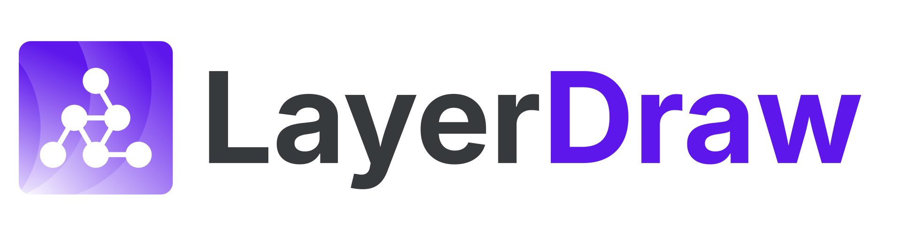
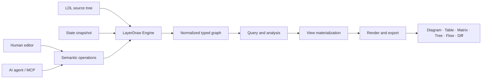

<p align="center">
  <picture>
    <source media="(prefers-color-scheme: dark)" srcset="brand/layerdraw-logo-on-dark.svg">
    <source media="(prefers-color-scheme: light)" srcset="brand/layerdraw-logo-on-light.svg">
    
  </picture>
</p>

<p align="center"><strong>Don’t maintain diagrams. Define the structure.</strong></p>
<p align="center"><strong>Change one fact. Every view stays current.</strong></p>

<p align="center">
  A typed, layered graph platform for defining structure once and deriving reproducible views.
</p>

<p align="center">
  <a href="LICENSE"></a>
  <a href="docs/legal/README.md"></a>
  <a href="docs/legal/use-cases.md"></a>
  <a href="docs/ldl-language-specification.md"></a>
</p>

LayerDraw is not a free-form drawing tool. It is a structural source of truth that can generate diagrams, tables, matrices, reports, exports, and agent context from the same typed graph.

```text
Traditional diagramming
  shapes + coordinates + connectors = one document

LayerDraw
  typed graph + attribute tables + layers + view recipes = many reproducible views
```

## Product Model

| Primitive | Role |
| --- | --- |
| **Typed graph** | Entities and directed Relations with explicit meaning, constraints, and typed attributes |
| **2D attributes** | Tabular rows attached to Entities and Relations |
| **Layers** | Independent concerns that can be maintained separately and composed into views |
| **Queries** | Deterministic selection, traversal, search, and analysis over the canonical graph |
| **Views** | Saved recipes that project graph facts into diagrams, tables, matrices, trees, flows, diffs, and exports |
| **References** | Project-specific guidance that humans and AI agents can retrieve through the same file model |



The LayerDraw Engine (implemented in Go) is the single authority for LDL parsing, validation, identity, query planning, semantic operations, and ViewData materialization. TypeScript owns clients, editor presentation, layout, rendering, and host integration. The frontend does not implement a second LDL semantics layer.

## LayerDraw Language

`.ldl` is the human-readable, Git-friendly source format. Stable authored symbols make scoped inspection and edits practical for both developers and coding agents.

```ldl
project order_platform "Order Platform" {
  description "Production order processing"
}

layers {
  application "Application" @20
}

entity_type service "Service" {
  representation shape rounded
  columns {
    runtime "Runtime" string required
  }
}

entities service @application {
  order_api "Order API"
  payment_api "Payment API"
}

rows service [runtime] {
  order_api primary: "Go"
  payment_api primary: "TypeScript"
}

relation_type calls "Calls" dependency {
  from caller types [service]
  to callee types [service]
  label "calls"
}

relations calls {
  order_to_payment: order_api -> payment_api
}
```

LDL definitions stay separate from generated state, provenance, history, previews, and exports. Projects can be shared as portable `.layerdraw` containers; reusable type and relation packs are distributed as `.ldpack` artifacts.

## Representative Uses

LayerDraw is intentionally not limited to one domain. The same model supports several product surfaces and workflows:

| Use | What LayerDraw provides |
| --- | --- |
| Living architecture | Keep systems, dependencies, data movement, runtime, infrastructure, and operational facts in one source model |
| Typed AI memory | Give agents a shared, queryable structure instead of unbounded notes |
| Semantic layers | Define typed domain models, relations, attributes, and reusable views |
| System and data modeling | Keep entities, relationships, ownership, interfaces, and constraints editable as source |
| Reusable operational views | Generate review, audit, migration, incident, planning, and reporting views from the same facts |

## Planned Surfaces

The same Engine and document model are designed to support:

| Surface | Primary use |
| --- | --- |
| **Web application** | Browser editing, projects, collaboration, history, and sharing |
| **Desktop** | Local-first file workflows through a native Wails shell |
| **VS Code** | LDL editing, validation, preview, and agent-assisted changes |
| **Client SDK** | Viewer and browser editor embedding |
| **Server SDK** | Host integration through sidecar or server-managed runtime |
| **MCP Apps** | Live rendering of structures created or updated by AI agents |
| **Self-host Server** | Organizations, workspaces, projects, realtime collaboration, history, and pluggable storage |
| **Marketplace integrations** | Host ecosystem integrations for storage, launch, sharing, and distribution |

Storage is a host capability rather than an Engine dependency. Local files and remote object or document storage providers are connected through adapters.

## Repository Status

LayerDraw is currently at the implementation reboot stage.

- Product requirements, LDL language, component boundaries, runtime contracts, licensing model, and repository architecture are specified.
- This repository is being rebuilt from the documented boundaries.
- There is no stable release or supported installation path yet.

## Documentation

Start with these documents:

| Document | Scope |
| --- | --- |
| [Requirements](docs/requirements.md) | Product behavior and complete feature requirements |
| [Blueprint](docs/blueprint.md) | Product forms, features, packages, and system-wide mapping |
| [Technical Architecture](docs/architecture.md) | Go, TypeScript, framework, process, and delivery boundaries |
| [LDL Language Specification](docs/ldl-language-specification.md) | Canonical syntax, modules, identity, Query, View, and migration |
| [System Boundary Contracts](docs/system-boundary-contracts-specification.md) | Engine, Runtime, Realtime, Query, Registry, Render, SDK, and version contracts |
| [Views and Projections](docs/views-and-projections.md) | How the canonical graph becomes typed views |
| [AI and MCP](docs/ai-integration.md) | Scoped discovery, context budgets, preview, and editing workflows |
| [License Design](docs/legal/README.md) | License matrix, hosted boundaries, use cases, trademark, and CLA |

The complete index is in [docs/README.md](docs/README.md).

## Community

- Read [CONTRIBUTING.md](CONTRIBUTING.md) before opening a pull request.
- Use [SUPPORT.md](SUPPORT.md) to choose the correct support or reporting channel.
- Participation is governed by [CODE_OF_CONDUCT.md](CODE_OF_CONDUCT.md).
- Report vulnerabilities according to [SECURITY.md](SECURITY.md), never through a public issue.

## License

LayerDraw uses a mixed-license source-available model.

- Product source is licensed under the [LayerDraw License 1.0](LICENSE).
- Self-hosting, proprietary embedding, fixed-model commercial applications, and read-only viewing services are permitted by that license.
- A stock, white-label, or general-purpose hosted LayerDraw service requires a separate Commercial / OEM License.
- Designated protocol schemas, generated wire bindings, and low-level interoperability surfaces use Apache-2.0.
- User-created `.ldl`, `.layerdraw`, `.ldpack`, diagrams, and exports do not inherit the product license merely because LayerDraw produced or processed them.

See the [license use cases](docs/legal/use-cases.md) for concrete examples. LayerDraw is not represented as an OSI-approved Open Source or Open Core project.

---

<p align="center">
  Built by <a href="https://dencyu.co.jp/">株式会社DENCYU</a>.
</p>
